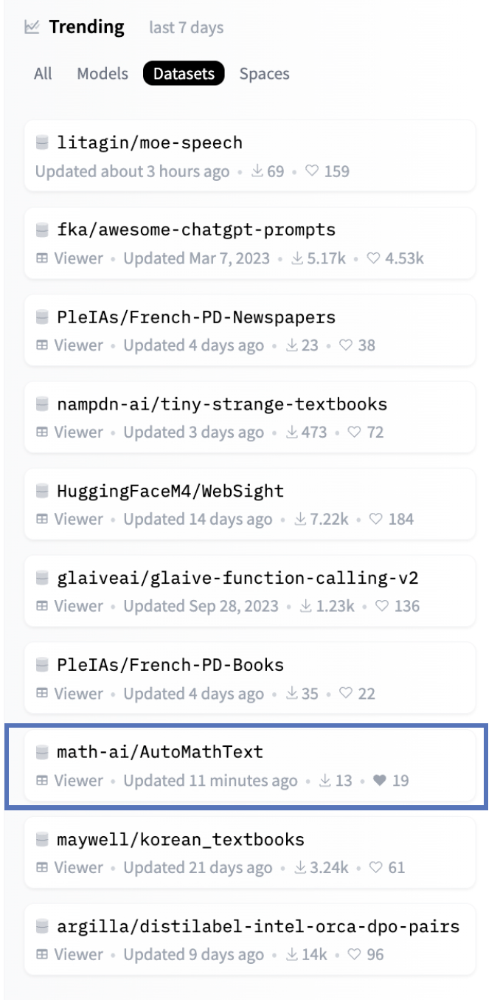
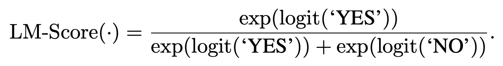

# AutoMathText: Autonomous Data Selection (AutoDS) 

[](https://arxiv.org/abs/2402.07625)


Homepage: https://auto-data-selection.github.io.

## Introduction 

Official implementation of DPFM @ ICLR 2024 paper "AutoMathText: Autonomous Data Selection with Language Models for Mathematical Texts" (https://arxiv.org/abs/2402.07625).

**Featured as Huggingface Daily Papers! (https://huggingface.co/papers/2402.07625)**

**AutoMathText** is an extensive and carefully curated dataset encompassing around **200 GB** of mathematical texts. It's a compilation sourced from a diverse range of platforms including various websites, arXiv, and GitHub (OpenWebMath, RedPajama, Algebraic Stack). This rich repository has been **autonomously selected (labeled) by the state-of-the-art open-source language model**, Qwen-72B. Each piece of content in the dataset is assigned **a score `lm_q1q2_score` within the range of [0, 1]**, reflecting its relevance, quality, and educational value in the context of mathematical intelligence.

### Trending on Huggingface! 

Huggingface dataset: https://huggingface.co/datasets/math-ai/AutoMathText



### Objective

The primary aim of the **AutoMathText** dataset is to provide a comprehensive and reliable resource for a wide array of users - from academic researchers and educators to AI practitioners and mathematics enthusiasts. This dataset is particularly geared towards:

- Facilitating advanced research in **the intersection of mathematics and artificial intelligence**.
- Serving as an educational tool for **learning and teaching complex mathematical concepts**.
- Providing **a foundation for developing and training AI models** specialized in processing and understanding **mathematical content**.

## Autonomous Data Selection with Language Models

### Zero-shot Data Selection without Alignment (SFT / RLHF)

- Meta Prompt for Selecting OpenWebMath: 

```XML
"""<system>
You are ChatGPT, the most capable large language model equipped with extensive expertise in
mathematics and coding, particularly skilled in complex reasoning and problem-solving.
In the following interaction, I will provide you with a text excerpt from a website.
Your task is to evaluate whether this text contains elements of mathematical intelligence
and if it is suitable for educational purposes for YOURSELF in the field of mathematics.
Please respond with only YES or NO
<\system>

User: {
    "url": "{url}",
    "text": "{text}"
}
1. Does the text contain elements of mathematical intelligence? Reply with only YES or NO
2. Is the text suitable for educational purposes for YOURSELF in the field of mathematics? Reply with only YES or NO
Assistant: 1."""
```
- Meta Prompt for Selecting ArXiv: 

```XML
"""<system>
You are ChatGPT, the most capable large language model equipped with extensive expertise in
mathematics and coding, particularly skilled in complex reasoning and problem-solving.
In the following interaction, I will provide you with a text excerpt from the arXiv website.
Your task is to evaluate whether this text contains elements of mathematical intelligence
and if it is suitable for educational purposes for YOURSELF in the field of mathematics.
Please respond with only YES or NO 
<\system>
User: {
    "Title": "{title}",
    "Abstract": "{abstract}",
    "Text": "{text}"
}
1. Does the text contain elements of mathematical intelligence? Reply with only YES or NO
2. Is the text suitable for educational purposes for YOURSELF in the field of mathematics? Reply with only YES or NO
Assistant: 1."""
```

- Meta Prompt for Selecting Github: 

```XML
"""<system>
You are ChatGPT, the most capable large language model equipped with extensive expertise in
mathematics and coding, particularly skilled in complex reasoning and problem-solving.
In the following interaction, I will provide you with a code excerpt from a website.
Your task is to evaluate whether this code contains elements of mathematical intelligence
 and if it is suitable for educational purposes for YOURSELF in the field of mathematics.
Please respond with only YES or NO
<\system>
User: {
    "Repository": "{repo_name}",
    "File Path": "{file_url}",
    "Code Excerpt": "{text}"
}
1. Does the code contain elements of mathematical intelligence? Reply with only YES or NO
2. Is the code suitable for educational purposes for YOURSELF in the field of mathematics? Reply with only YES or NO
Assistant: 1."""
```

#### The LM-Score Function




## Dataset Usage with Huggingface API

### Configs

```YAML
configs:
  - config_name: web-0.50-to-1.00
    default: true
  - config_name: web-0.60-to-1.00
  - config_name: web-0.70-to-1.00
  - config_name: web-0.80-to-1.00
  - config_name: web-full
  - config_name: arxiv-0.50-to-1.00
  - config_name: arxiv-0.60-to-1.00
  - config_name: arxiv-0.70-to-1.00
  - config_name: arxiv-0.80-to-1.00
  - config_name: arxiv-full
  - config_name: code-0.50-to-1.00
  - config_name: code-python-0.50-to-1.00
  - config_name: code-python-0.80-to-1.00
  - config_name: code-full
```

How to load data:

```python
from datasets import load_dataset

ds = load_dataset("math-ai/AutoMathText", "web-0.50-to-1.00") # or any valid config_name
```

### Features

- **Volume**: Approximately 200 GB of text data (in natural language and programming language).
- **Content**: A diverse collection of mathematical texts, including but not limited to research papers, educational articles, and code documentation.
- **Labeling**: Every text is **scored** by Qwen-72B, a sophisticated language model, ensuring a high standard of relevance and accuracy.
- **Scope**: Covers a wide spectrum of mathematical topics, making it suitable for various applications in advanced research and education.

## References

- OpenWebMath [[link]](https://huggingface.co/datasets/open-web-math/open-web-math)
- RedPajama [[link]](https://huggingface.co/datasets/togethercomputer/RedPajama-Data-1T)
- Algebraic Stack [[link]](https://huggingface.co/datasets/EleutherAI/proof-pile-2) (a subset of Proof-Pile-2)

## Citation 
We appreciate your use of **AutoMathText** in your work. If you find this repository helpful, please consider citing it and star this repo. Feel free to contact zhangyif21@tsinghua.edu.cn or open an issue if you have any questions.

```bibtex
@article{zhang2024automathtext,
  title={AutoMathText: Autonomous Data Selection with Language Models for Mathematical Texts},
  author={Zhang, Yifan and Luo, Yifan and Yuan, Yang and Yao, Andrew Chi-Chih},
  journal={arXiv preprint arXiv:2402.07625},
  year={2024}
}
```
